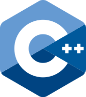

# C++ #

STUFF

---

## Introduction ##

### Target Readership ###

### Aims ###

#### Don't Panic! ####

### Non-Aims ###

### Enforcement ###

### The Structure of this Document ###

## Philosophy ##

#### Express Ideas Directly in Code ####

#### Write in ISO Standard C++ ####

#### Express Intent ####

#### Ideally, a Program Should be Statically Type Safe ####

#### Prefer Compiler-Time Checking to Run-Time Checking ####

#### What Cannot be Checked at Compile Time Should be Checked at Run Time ####

#### Catch Run-Time Errors Early ####

#### Don't Leak Any Resources ####

#### Don't Waste Time or Space ####

#### Prefer Immutable Data to Mutable Data ####

#### Encapsulate Messy Constructs, Rather Than Spreading Through the Code ####

#### Use Supporting Tools as Appropriate ####

#### Use Support Libraries as Appropriate ####

## Interfaces ##

#### Make Interfaces Explicit ####

#### Avoid Non-Const Global Variables ####

#### Avoid Singletons ####

#### Make Interfaces Precisely and Strongly Typed ####

#### State Preconditions ####

#### Prefer Expects for Expressing Preconditions ####

#### State Postconditions ####

#### Prefer Ensures for Expressing Postconditions ####

#### If an Interface is a Template, Document its Parameters Using Concepts ####

#### Use Exceptions to Signal a Failure to Preform a Required Task ####

#### Never Transfer Ownership by a Raw Pointer or Refernece ####

#### Declare a Pointer that Must not be Null as not_null ####

#### Do not Pass an Array as a Single Pointer ####

#### Avoid Complex Initialization of Global Objects ####

#### Keep the Number of Function Arguments Low ####

#### Avoid Adjacent Unrelated Parameters of the Same Type ####

#### Prefer Abstract Classes as Interfaces to Calss Hierarchies ####

#### If You Want a Cross-COmpiler ABI, Use a C-Stype Subset ####

#### For Stable Library ABI, Consider the Pimpl Idiom ####

#### Encapsulate Rule Violations ####

## Functions ##

### Function Definition ###

#### "Package" Meaningful Operations as Carefully Named Funcitons ####

#### A Function Should Preform a Single Logical Operation ####

#### Keep Functions Short and Simple ####

#### If a Function May Have to be Evaluated at Compile Time, Declare it Constexpr ####

#### If a Function is Very Small and Time-Critical, Declare it Inline ####

#### If Your Function May Not Throw, Declare it Noexcept ####

#### For General Use, Take T* or T& Arguments Rather Than Smart Pointers ####

#### Prefer Pure Functions ####

#### Unused Parameters Should be Unnamed ####

### Parameter Passing Expression ###

#### Prefer Simple and Conventional Ways of Passing Information ####

#### For "in" Parameters, Pass Cheaply-Copied Types by Value and Others by Reference to Const ####

#### For "in-out" Parameters, Pass by Reference to Non-Const ####

#### For "will-move-from" Parameters, Pass by X&& and std::move the Parameter ####

#### For "forward" Parameters, Pass by X&& and only std::forward the Parameter ####

#### For "out" output Values, Prefer Return Values to Output Parameters ####

#### To Return multiple "out" Values, Prefer returning a Tuple or Struct ####

#### Prefer T* over T& when "no argument" is a Valid Option ####

### Parameter Passing Semantic ###

#### Use T* or owner<T*> to Designate a Single Object ####

#### Use a not_null<T> to Indicate that "null" is not a Valid Value ####

#### Use a span<T> or  a span_p<T> to Designame a Half-Open Sequence ####

#### Use a zstring or a not_null<zstring> to Designate a C-Style String ####

#### Use a unique_ptr<T> to Transfer Ownership Where a Pointer is Needed ####

#### Use a shared_ptr<T> to Share Ownership ####

### Value Return Semantic ###

#### Return a T* to Inicate a Position (Only) ####

#### Never (Directly or Indirectly) return a Pointer or a Reference to a Local Object ####

#### Return a T& When COpy is Undesirable and "returning no object" isn't Needed ####

#### Don't Return a T&& ####

#### int is the Return Type for main() ####

#### Reuturn T& from Assignment Operators ####

### Other ###

#### Use a Lambda When a Function Won't do (to Capture Local Variables, or to Write a Local Function) ####

#### Where There is a Choice, Prefer Default Arguments Over Overloading ####

#### Prefer Capturing by Reference in Lambdas That Will be Used Locally, Including Passed to Algorithms #### 

#### Avoid Capturing by Reference in Lambdas That Will be Used Nonlocally, Including Returned, Sotred on the Heap, or Passed to Another Thread #### 

#### If you Capture this, Capture all Variables Explicitly (No Default Capture) ####

#### Don't use va_arg Arguments ####

## Classes and Class Hierarchies ##

#### Organize Related Data into Structures (structs or classes) ####

#### Use class if the class has an invariant; use struct if the data members can vary independently ####

#### Represent the distinction between an interace and an implementation using a class ####

#### Make a Function a Member Only if it Needs Direct Access to the Representation of a Class ####

#### Place Helper Functions in the Same Namespace as the Class they Support ####

#### Don't define a class or enum and Declare a variable of its type in the same statement ####

#### Use class rather than struct if Any Member is non-public ####

#### Minimize Exposure of Members ####

### Concrete Types ###

#### Prefer Concrete Types over Class Hierarchies ####

#### Make Concreate Types Regular ####

### Constructors, Assignments, and Destructors ###

### Default Operations ###

#### If You Can Avoid Defining Any Default Operations, do ####

#### If You Define or =delete any Default operation, define or =delete them all ####

#### Make Default Operations Consistent ####

### Destructor Rules ###

#### Define a Destructor if a Class Needs an Explicit action at object destruction ####

HERE<<<<<<<<<<<<<<<<<<<<<<<<<<<<<<<<<<<<<<<<<<<<<<<<<<<<<<<<<<<<<<<<<<<<<<<<<<<

### Containers and Other resource Handles ###

### Function Objetcs and Lambdas ###

### Class Hierarchies(OOP) ###

### Overloading and overloaded operators ###

### Unions ###

## Enumerations ##

## Resource Management ##

## Expressions and Statements ##

## Preformance ##

## Concurrency ##

## Error Handling ##

## Constants and Immutability ##

## Templates and Generic Programming ##

## C-Stype Programming ##

## Source Files ##

## The Standard Library ##

## Architectural Ideas ##

## Non-Rules and Myths ##

## Profiles ##

## Guideline Support Library ##

## Naming and Layout ##

