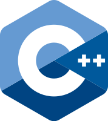

# Style Guides

This is a collection of style guides for a wide selection of different
programming languages. Each guide also provides a brief description of the
language. More comparisions of the programming languages can be found in the
[Lexici](https://github.com/LuxAtrumStudio/lexici) repo.

|        |  |
| ----------------------------- | --------------------------------------------- |
|  |                                               |
